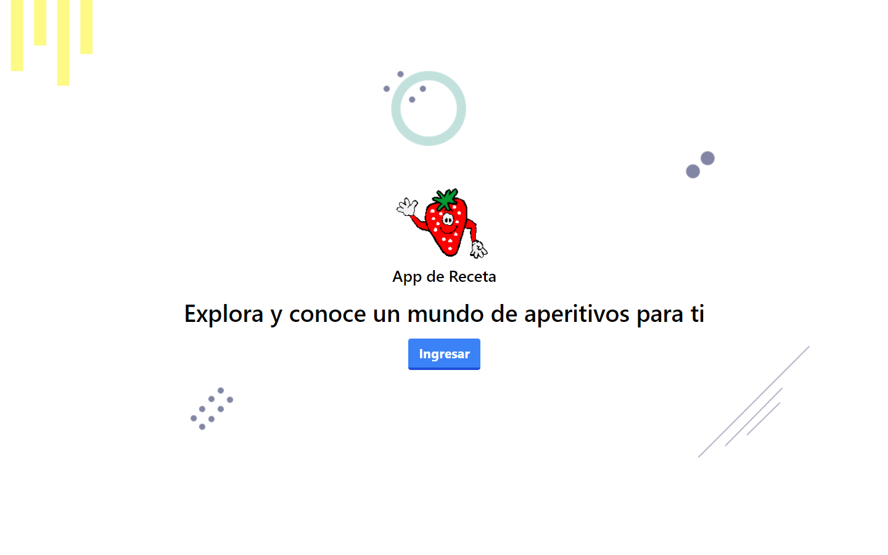

# App de Receta

## Descripción

Esta es una app desarrollado con motivo de estudio en la asignatura de programación Web, validada como proyecto final de la materia. Esta aplicación desarrollada con React es una app que le permitirá a los usuarios que se registren con un correo o una cuenta de Google poder buscar diferentes recetas sencillas, así también guardar sus favoritas.

La aplicación cuenta con una autentificación de usuarios con las validaciones necesarias para que se sigan los estatutos establecidos para ingresar a la página principal de la app, donde el usuario podrá explorar y buscar una receta, condimento o alguna fruta y se le presentara algunas recetas que se puedan hacer con lo que ingreso a buscar si están disponibles en la API.

#### 👨‍💻 Luis Emilio Valenzuela
